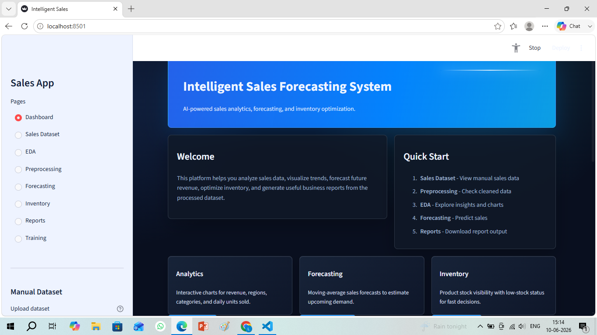

# 📈 Intelligent Sales Forecasting and Inventory Optimization System

## **DEMO LINK**
https://intelligent-sales-forecasting-system.onrender.com

## 📌 Project Overview

The **Intelligent Sales Forecasting and Inventory Optimization System** is a Streamlit-based machine learning application that helps businesses analyze historical sales data, forecast future revenue, and optimize inventory levels.

This system combines data analytics, machine learning, and interactive visualizations to support better business decision-making and improve operational efficiency.

## Dashboard Preview



---

## 🚀 Features

* 📂 Upload Sales Dataset (CSV)
* ⚙ Data Preprocessing
* 📊 Exploratory Data Analysis (EDA)
* 🤖 Machine Learning Model Training
* 📈 Sales Forecasting
* 📦 Inventory Optimization
* 📋 Report Generation
* 🎨 Interactive Dashboard using Streamlit

---

## 🛠 Technologies Used

### Frontend

* Streamlit

### Backend

* Python

### Libraries

* Pandas
* NumPy
* Matplotlib
* Seaborn
* Plotly
* Scikit-Learn
* Joblib

---

## 📁 Project Structure

```text
intelligent-sales-forecasting/
│
├── app.py
│
├── pages/
│   ├── data_upload.py
│   ├── preprocessing.py
│   ├── eda.py
│   ├── training.py
│   ├── forecasting.py
│   ├── inventory.py
│   └── reports.py
│
├── datasets/
│   └── sales_data.csv
│
├── models/
│   └── sales_model.pkl
│
├── reports/
│   └── forecast_report.csv
│
├── utils/
│
├── requirements.txt
│
└── README.md
```

---

## 🎯 Problem Statement

Businesses often face challenges in predicting future sales accurately. Poor forecasting can lead to stock shortages, excess inventory, increased operational costs, and reduced profitability.

This project addresses these challenges by developing an intelligent forecasting system that analyzes historical sales data and predicts future demand using machine learning techniques.

---

## 🎯 Objectives

* Forecast future sales accurately
* Identify revenue trends
* Optimize inventory levels
* Reduce stock shortages
* Improve supply chain efficiency
* Support data-driven decision-making

---

## 🔄 Workflow

```text
Dataset Upload
      ↓
Data Preprocessing
      ↓
EDA Analysis
      ↓
Model Training
      ↓
Sales Forecasting
      ↓
Inventory Optimization
      ↓
Report Generation
```

---

## 📊 Dataset Attributes

| Column   | Description   |
| -------- | ------------- |
| Date     | Sales Date    |
| Product  | Product Name  |
| Region   | Sales Region  |
| Quantity | Units Sold    |
| Price    | Product Price |
| Revenue  | Total Revenue |

---

## 🤖 Machine Learning Model

The system uses:

* Linear Regression

for predicting future revenue based on historical sales patterns.

---

## 📦 Inventory Optimization

The inventory module provides:

* Demand Forecasting
* Reorder Recommendations
* Stock Management Insights

This helps businesses maintain optimal inventory levels while reducing storage costs.

---

## ▶ Installation

### Clone Repository

```bash
git clone https://github.com/yourusername/intelligent-sales-forecasting.git
```

### Move into Project

```bash
cd intelligent-sales-forecasting
```

### Install Requirements

```bash
pip install -r requirements.txt
```

### Run Application

```bash
streamlit run app.py
```

### Inventory Optimization

```markdown

```

---

## 🔮 Future Enhancements

* Deep Learning Forecasting Models
* Real-Time Data Integration
* Cloud Deployment
* Multi-Store Management
* AI Recommendation Engine
* Automated Email Reports

---

## 📈 Expected Benefits

* Improved Forecast Accuracy
* Better Inventory Planning
* Reduced Operational Costs
* Increased Profitability
* Enhanced Business Insights

---

## 👨‍💻 Author

**Likitha Nandini**

B.Tech Student

Machine Learning & Data Analytics Enthusiast

---

## ⭐ Conclusion

The Intelligent Sales Forecasting and Inventory Optimization System demonstrates how machine learning can be applied to business analytics for predicting future sales trends and optimizing inventory management. The system enables organizations to make smarter decisions, improve operational efficiency, and maximize profitability.

